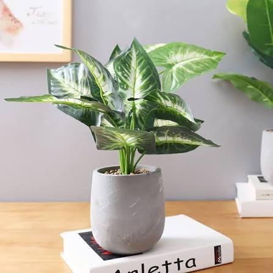
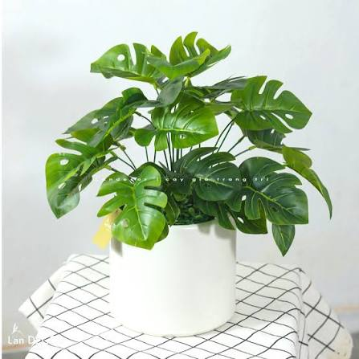
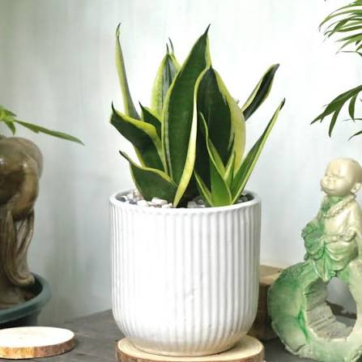

<!-- filepath: D:/AppData/Code/Project/Android/tree_store/README.md -->

<h1 align="center">Tree Store - Fullstack Plant & Tree E-commerce</h1>

<p align="center">
  <a href="https://flutter.dev" target="_blank"></a>
  <a href="https://kotlinlang.org" target="_blank"></a>
  <a href="https://ktor.io" target="_blank"></a>
  <a href="#license"></a>
</p>

<p align="center"><b>A modern, cross-platform mobile application for tree lovers, featuring a Kotlin-powered backend and Server-Driven UI (SDUI).</b></p>

---

## 📋 Table of Contents

- [Introduction](#introduction)
- [Features](#features)
- [Technologies](#technologies)
- [Quick Setup](#quick-setup)
- [Project Structure](#project-structure)
- [Environment](#environment)
- [Server-Driven UI (SDUI)](#server-driven-ui-sdui)
- [API Documentation](#api-documentation)
- [Demo Screenshots](#demo-screenshots)
- [Contributing](#contributing)
- [Author & Contact](#author--contact)
- [License](#license)

---

## 👋 Introduction

**Tree Store** is a fullstack e-commerce project designed for selling plants and trees. It consists of a high-performance **Flutter** mobile application and a robust **Kotlin Ktor** backend. The project stands out with its **Server-Driven UI** approach for the home screen, allowing dynamic layout updates without app redeployment.

---

## ✨ Features

<table>
  <tr>
    <td>🔐 JWT Authentication (Login/Register/OTP)</td>
    <td>🛒 Cart Management & Checkout</td>
    <td>📦 Order Tracking & History</td>
  </tr>
  <tr>
    <td>🌳 Detailed Tree Catalog with Categories</td>
    <td>🏠 Dynamic SDUI Home Screen</td>
    <td>💳 Integrated Payment (PayOS/MoMo/VNPAY)</td>
  </tr>
</table>

---

## 🛠️ Technologies

| Frontend (Flutter) | Backend (Kotlin/Ktor) | Database & Tools |
|--------------------|-----------------------|------------------|
| Flutter SDK        | Ktor Server           | PostgreSQL       |
| BLoC State Management| Exposed ORM          | Exposed & JDBC   |
| GoRouter           | Kotlinx Serialization | Drift & Hive (Local) |
| Dio (Networking)   | JWT Auth              | Swagger/OpenAPI  |

---

## ⚡ Quick Setup

<details>
<summary><b>Frontend (Flutter)</b></summary>

```bash
cd tree_store_app
# Create .env file from template if necessary
flutter pub get
flutter run
```

</details>

<details>
<summary><b>Backend (Kotlin/Ktor)</b></summary>

```bash
cd kotlin_backend
# Ensure PostgreSQL is running and configured in application.conf
./gradlew run
```

</details>

---

## 📂 Project Structure

```text
tree_store/
├── tree_store_app/      # Flutter Mobile Application
│   ├── lib/             # Clean Architecture Implementation
│   │   ├── core/        # DI, Theme, Routing, Utils, Network
│   │   ├── data/        # Repositories, Data Sources (Remote/Local), Mappers
│   │   ├── domain/      # Entities, Use Cases, Repository Interfaces
│   │   └── presentation/# BLoCs, Screens, Widgets (UI Layer)
│   ├── assets/          # Images, fonts, and localizations
│   └── pubspec.yaml     # Flutter dependencies
│
├── kotlin_backend/      # Kotlin Ktor Backend
│   ├── src/             # Kotlin source code
│   ├── build.gradle.kts # Gradle configuration
│   └── resources/       # Static assets & config
│
└── tree_payment/        # Payment integration research & docs
```

---

## ⚙️ Environment

- `.env`: Development & Production configuration (API Keys, Base URL)
- `kotlin_backend/src/main/resources/application.conf`: Backend configuration (Database, JWT, Payment Secrets)

---

## 🏗️ Server-Driven UI (SDUI)

The Home Screen is built using a **Server-Driven UI** model. The backend serves a list of `UiBlocks` (Banners, Horizontal Lists, Grids) which the Flutter app renders dynamically.

- **Endpoint:** `GET /api/home`
- **Supported Blocks:** `banner_carousel`, `quick_actions`, `product_horizontal_list`, `product_grid`, `category_tabs`, `featured_hero`, `care_tip_card`.

---

## 🔌 API Documentation

Major API routes available in the system:

<details>
<summary><b>Authentication & Profile</b></summary>

- `POST /api/auth/register` — Register new user
- `POST /api/auth/login` — Login & get tokens
- `POST /api/auth/refresh` — Refresh access token
- `GET /api/profile` — Get current user profile
- `POST /api/otp/send` — Send OTP to email

</details>

<details>
<summary><b>Product & Home</b></summary>

- `GET /api/home` — SDUI Home screen configuration
- `GET /api/categories` — List all tree categories
- `GET /api/trees` — List trees with filters (paging, category)
- `GET /api/trees/{id}` — Get specific tree details

</details>

<details>
<summary><b>Cart & Orders</b></summary>

- `GET /api/cart` — Get current user cart
- `POST /api/cart` — Add/Update item in cart
- `POST /api/orders` — Create new order
- `GET /api/orders` — List user order history
- `GET /api/orders/{id}` — Get order details

</details>

<details>
<summary><b>Payments</b></summary>

- `POST /api/orders/{id}/payment` — Create payment link
- `POST /api/payments/{provider}/webhook` — Payment gateway webhook (IPN)

</details>

> 📄 <b>View full Swagger UI:</b> [http://localhost:8080/swagger-ui](http://localhost:8080/swagger-ui) (when backend is running).

---

## 🖼️ Demo Screenshots

<details>
<summary><b>🏠 Home Screen & SDUI Components</b></summary>
<p align="center">
  
  
  
</p>
</details>
<details>
<summary><b>🛒 Cart & Checkout</b></summary>
<p align="center">
  
  
</p>
</details>

---

## 🤝 Contributing

Contributions are what make the open-source community such an amazing place to learn, inspire, and create. Any contributions you make are **greatly appreciated**.

---

## 👨‍💻 Author & Contact

- **Your Name**
  Email: <nguyen12112005@gmail.com>
  GitHub: [NguynNe3110](https://github.com/NguynNe3110)

---

## 📄 License

Distributed under the MIT License. See `LICENSE` for more information.
